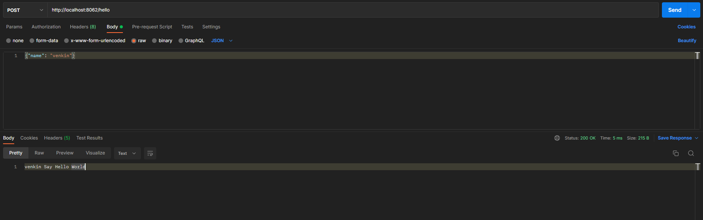

# venkin

### Project Description
```
HTTP Server Routing Layer Framework
```

### Development Language
```
GoLang
```

### Language version
```
1.18
```

### Quick Start
```gotemplate
package main

import (
    "venkin/core"
)

func main() {
    // port enabled by default: 8062
    core.Run(nil)
}
```

### Hello World Request Example
```gotemplate
// First you need to declare a struct to be used as the identifier of the route callback
// Then you need to compose the ControllerImpl struct in it
// If the request has parameters
// The framework currently only supports JSON transmission for the time being
// To get parameter data
// you only need to add the structure of the data model to the corresponding structure that identifies the routing callback
// There is a convention here: The order of ControllerImpl and parameter data structures must be preceded by ControllerImpl
// Then the routing structure rewrites which method of ControllerImpl and decide the type of http request that the structure can receive

package controller

import "venkin/core"

type HelloWord struct {
    core.ControllerImpl
    User
}

type User struct {
    Name string
}

// At this point we are implementing the post request
func (h *HelloWord) Post() {
    // get request parameters
    // Two ways to obtain data, users can choose by themselves

    // user := h.GetReqBody().(*User)
    user := core.GetReqBodyFunc[User](&h.ControllerImpl)

    // return data
    h.SetRspBody([]byte(user.Name + " Say Hello World"))
}

// main 函数加入路由配置
// The key of RouterMap is the path of the route, and the value is a pointer to its mapped route identification structure
func main() {

    // So far, it has been identified that the HelloWord structure can receive post requests routed as hello
    core.RouterMap["/hello"] = &controller.HelloWord{}

    // port enabled by default: 8062
    core.Run(nil)
}
```
